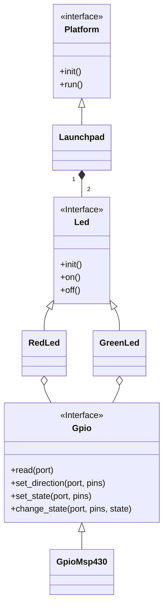

# C-OOP

Compare different OOP implementation patterns in C

## Design

Each example implements the following structure

```mermaid
classDiagram
    Platform <|-- Launchpad
    Launchpad "1" *-- "2" Led
    Led <|-- RedLed
    Led <|-- GreenLed
    RedLed o-- Gpio
    GreenLed o-- Gpio
    Gpio <|-- GpioMsp430

    class Platform{
        <<interface>>
        +init()
        +run()
    }
    class Launchpad{
    }

    class Led{
        <<Interface>>
        +init()
        +on()
        +off()
    }
    class RedLed{
    }
    class GreenLed{
    }

    class Gpio{
        <<Interface>>
        +read(port)
        +set_direction(port, pins)
        +set_state(port, pins)
        +change_state(port, pins, state)
    }
    class GpioMsp430{
    }
```

